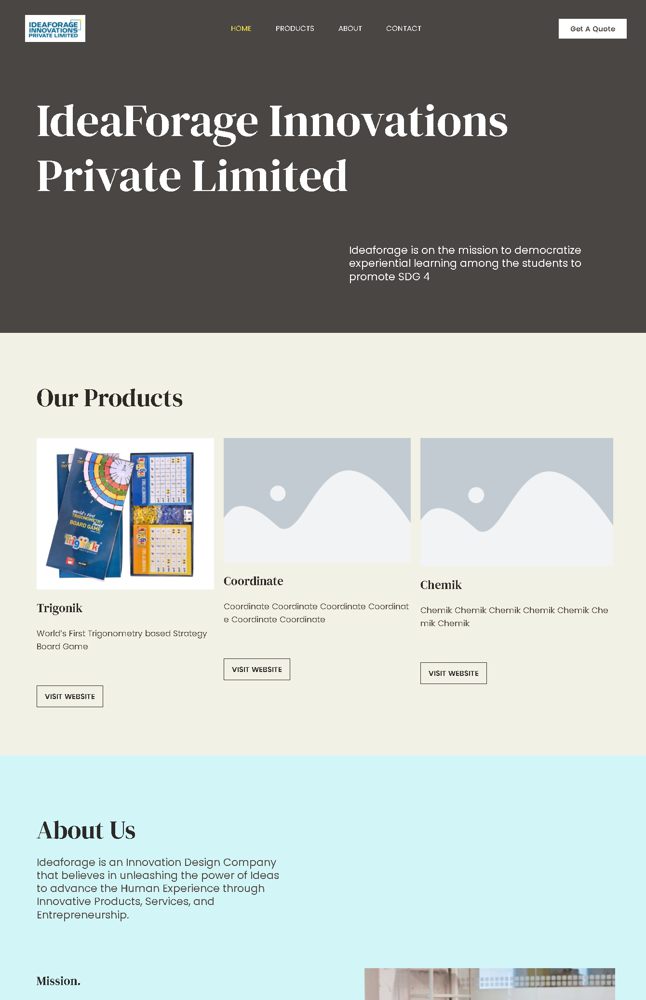
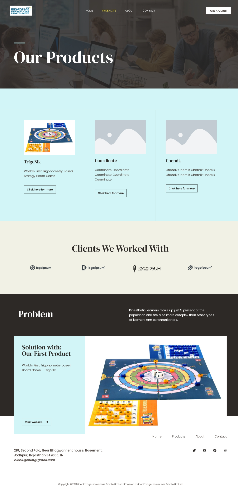
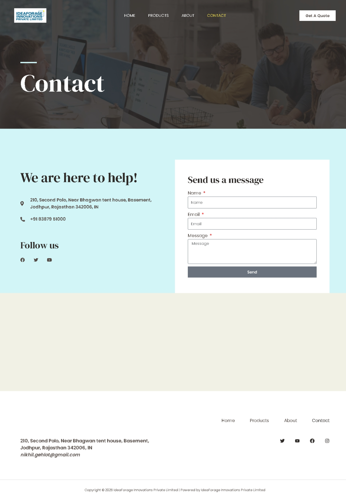

  

<h1 align="center">
  💼 Ideaforage Innovations Pvt. Ltd. - Business Website
</h1>

<h3 align="center">
   🅦 WordPress
</h3>

 

## 🌐 Live Website

👉 [Visit Ideaforage Website](https://idea.toynik.com/)

## 📌 Key Features

- ✅ Clean, modern, and responsive design
- 🏢 Detailed company profile and service offerings
- 📞 Contact form for inquiries
- 🧠 Blog or news section (if enabled)
- 🔗 Easy content management via WordPress Admin
- 🌐 SEO-ready and mobile-friendly layout

## 🛠️ Tech Stack

- **WordPress** – Core CMS
- **Elementor / Astra Theme** – Page building and layout control
- **PHP** – Backend language
- **MySQL** – Database management
- **CSS / JS** – Custom styling and interactivity

  
<!-- ................................................................................................................................. -->

### Sample Snapshots

Homepage:
     

Products: 
     

About:
     

Contact:
     

 

### Developer

Gaurav Sharma  
gaurav110601@gmail.com  
> [LinkedIn](https://www.linkedin.com/in/gaurav110601/)
<!-- ................................................................................................................................. -->
